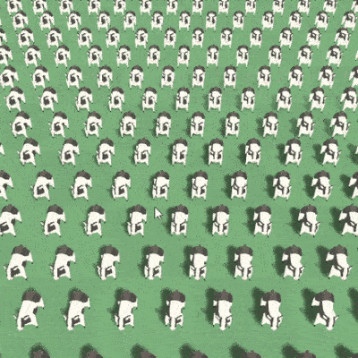

# Unity Objects Selection

Framework for implementing objects selection in Unity Engine.

Tutorial coming soon™

Note that the demo scene does not use instancing material currently. If you have bad GPU, it might be laggy because of that. 

## Implemented methods

### Lasso

Relatively optimized, with threading support. Scene in the gif above have 7700 selection points matched against a lasso with 100~200 vertices.

#### Algorithm benchmark:

10,000 vertices averaged over 5,000 run:

| Algorithm       | Time    |
|-----------------|---------|
| Crossing Number | 0.283ms |
| Winding Number  | 0.146ms |

---

[Plugging my asset](https://assetstore.unity.com/packages/tools/gui/translucent-image-high-performance-blur-behind-ui-78464?aid=1011l4nGC)
